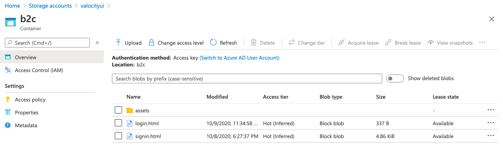
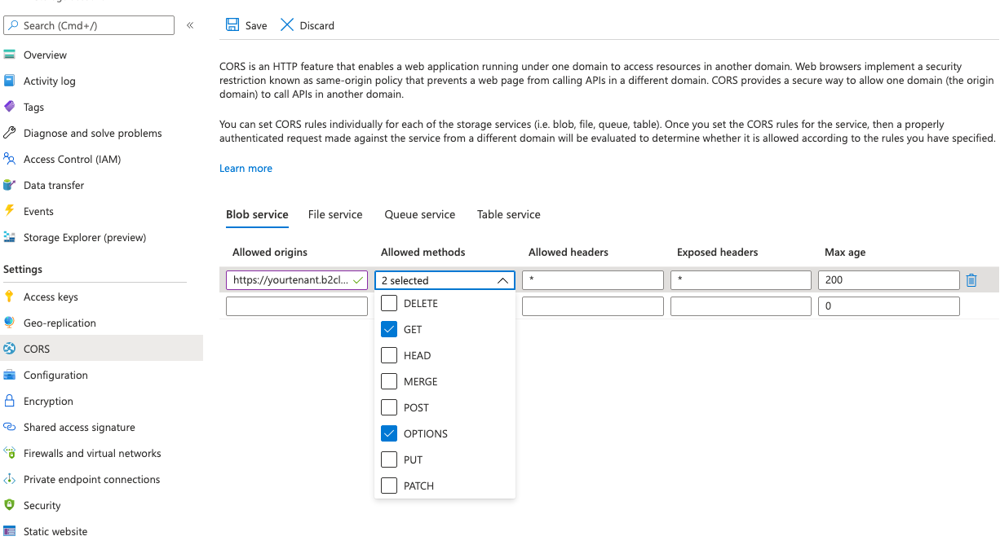
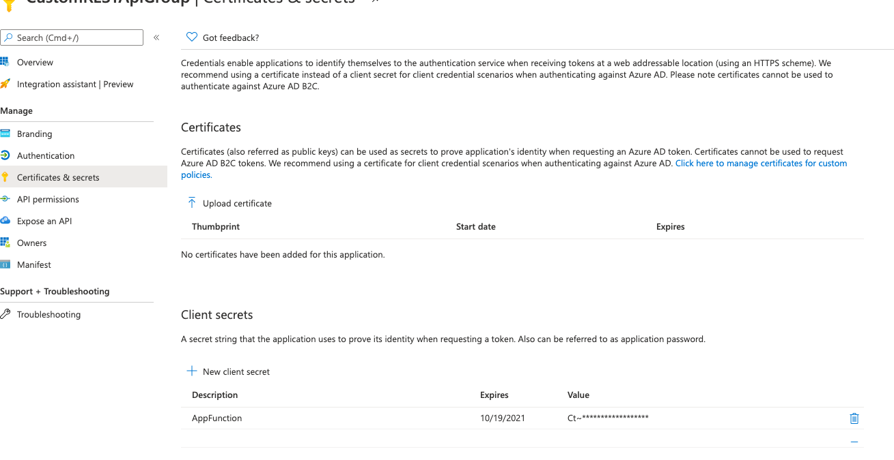
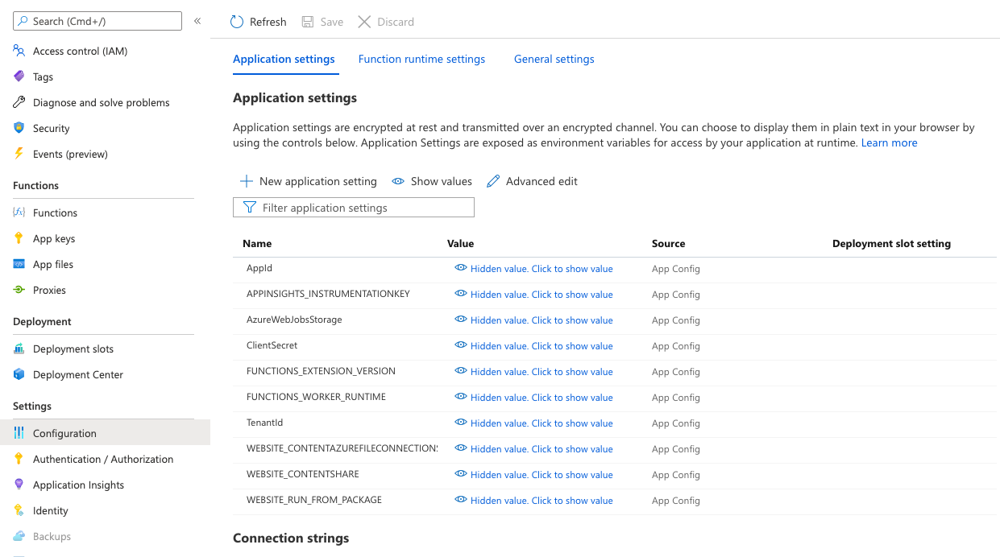
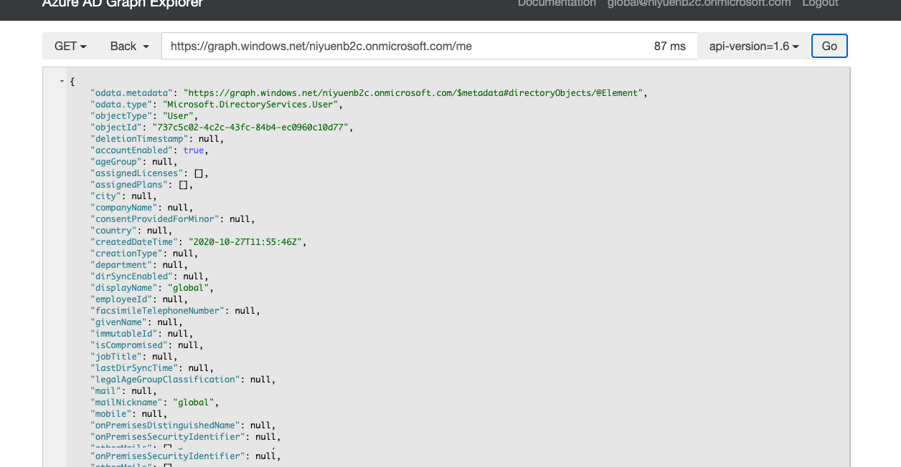
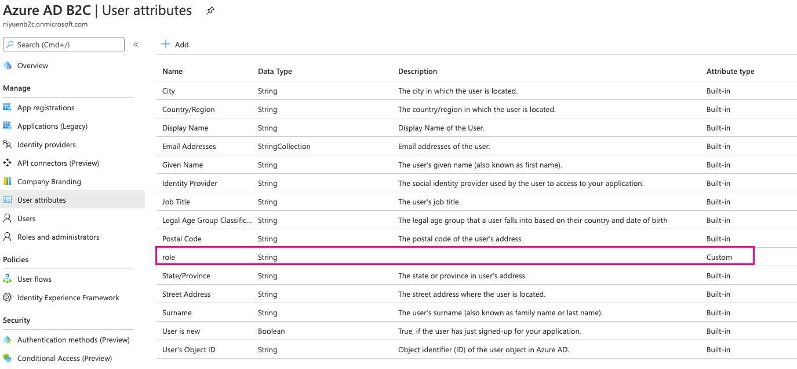
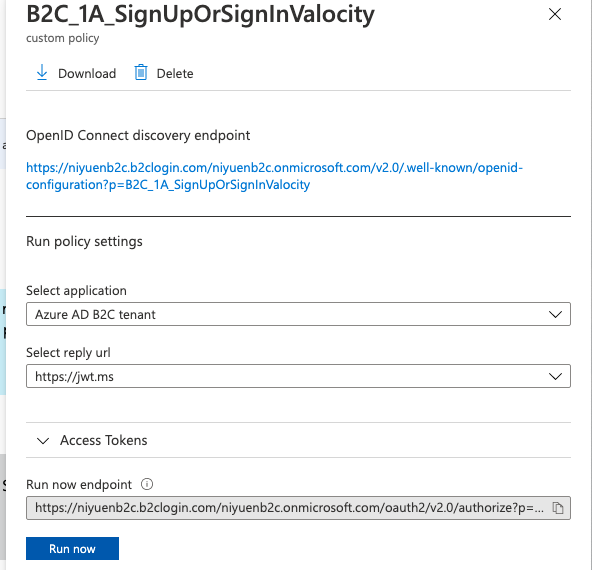
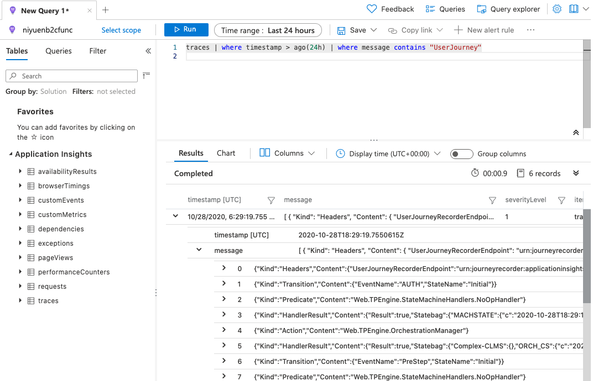

# Azure AD B2C with custom policy

## Introduction

This repository contains 3 sub-projects to handle a custom user authentication with Azure AD B2C with:

* Custom UI to implement a branded login user experience
* AD B2C custom policy:
  * Support for multiple authentication provider (Azure AD, username / password, GitHub)
  * REST API call to retrieve additinal user and group metadata using the Microsoft Graph API
  * Additional Claim schema
  * Relying Party implemation
* Azure Function (dotnet core) calling the graph API using Application permission on Azure Active Directory

## Pre-requisites

### Create a Azure AD B2C Tenant

To get started you will first need to create an Azure AD B2C Tenant as documented in https://docs.microsoft.com/en-us/azure/active-directory-b2c/tutorial-create-tenant

Make sure to link the Azure AD B2C Tenant to your Azure subscription

### Create an App

Before your applications can interact with Azure Active Directory B2C (Azure AD B2C), they must be registered in a tenant that you manage. This tutorial shows you how to register a web application using the Azure portal.

A "web application" refers to a traditional web application that performs most of the application logic on the server. They may be built using frameworks like ASP.NET Core, Maven (Java), Flask (Python), and Express (Node.js).

Create an App in your Azure AD B2C Tenant as per https://docs.microsoft.com/en-us/azure/active-directory-b2c/tutorial-register-applications

### Create a storage account

We need a storage account to store the custom ui code of our login page. you may also use an existing web application.

Next, create a container and set the public access level to blob in order to have the webpage and assets available without a SAS token

## Custom UI

The folder custom UI contains basic HTML and CSS to have a branded Azure AD B2C login page. The page **must** contain the following code:

```html
<!-- Leave this element empty because Azure AD B2C will insert content here. -->
<div id="api"></div> 
```

A sample UI is implemented in the UI folder:

* login.html: contains a very basic login form
* signin.html: contains a branded user experience
* assets: contains required CSS, images, that are embedded in the webpage

### Upload the custom UI to the blob storage 



Take not of the URL for the signin.html. Assuming you created a container called b2c you should have a url like: https://<storage_account_name>.blob.core.windows.net/b2c/signin.html

Note that HTTPS is mandatory, **also Enable CORS for your Storage Account**
I've configured both HEAD and GET with my Azure AD B2C tenant origin: https://yourtenant.b2clogin.com



## Azure Function and Graph API

The Graph REST Function project contains code to query the Microsoft Graph API using **Application-level authorization**:  There is no signed-in user (for example, a SIEM scenario). The permissions granted to the application determine authorization.

We will be calling the Microsoft Graph Security API from our own application, in this scenario an Azure Function:

The Azure AD tenant admin must explicitly grant consent to your application. This is required both for application-level authorization and user delegated authorization.

### Create an App Registration in the Azure AD B2C Tenant and grant the following permission

Create a new App Registration - I've called mine CustomRESTApiGroup. An assign App-level permission on the Graph API:

* Microsoft Graph
  * Directory.Read.All : The application must be able to read users and group, the Function will not make changes therefore we do not require Write permission
  * offline_access
  * openid


Next step we need to create a secret, we will be using both the AppID and App Secret in our Azure Function



### Configuring the Function App

The Function app accepts an objectId (the a user in the b2c tenant) and retrieves additional information using the Microsoft Graph API by querying the underlying Azure AD Tenant to retrieve group membership information. We will assigning groups and adding additional group properties at the Azure AD level (not the Azure AD **B2C**) which acts as the underlying control and data plane

The Function app requires the following information:

* AppId
* ClientSecret
* TenantId (The Azure AD B2C Tenant)

You can configure the local.settings.json file for local debugging, I've also set the Azure Function App Environment settings.



The Azure function has a single Method: `GetUserGroup` which accepts a single parameter `objectId` which will be the objectId of our user in the AD B2c Tenant.

The function first retrieve the app settings (either local or env variables)

```csharp
var appConfig = new ConfigurationBuilder()
                    .SetBasePath(context.FunctionAppDirectory)
// This gives you access to your application settings in your local development environment
                    .AddJsonFile("local.settings.json", optional: true, reloadOnChange: true) 
// This is what actually gets you the application settings in Azure
                    .AddEnvironmentVariables() 
                    .Build();
```

Next step is to create a client to query the Graph API. we are using a `IConfidentialClientApplication` interface from MASL (Microsoft Authentication Library) as documented: https://docs.microsoft.com/en-us/azure/active-directory/develop/msal-net-initializing-client-applications

```csharp
 // Initialize the client credential auth provider
IConfidentialClientApplication confidentialClientApplication = ConfidentialClientApplicationBuilder
    .Create(appConfig["AppId"])
    .WithTenantId(appConfig["TenantId"])
    .WithClientSecret(appConfig["ClientSecret"])
    .Build();
ClientCredentialProvider authProvider = new ClientCredentialProvider(confidentialClientApplication);

```

We can now create a client:

```csharp
GraphServiceClient graphClient = new GraphServiceClient(authProvider);
```

We are using the user ObjectID to retrieve group membership using the Graph client:

```chsarp
 var groupsRes = await graphClient
                    .Users[objectId]
                    .TransitiveMemberOf
                    .Request()
                    .GetAsync();
```

Finally we iterate on each group and filter them out to only retrieve security groups. Special not on the custom property in the code:

```csharp
currentGroup.tenantType = $"{groupDetails.AdditionalData["extension_<YOUR_B2C_GENERATE_APP_ID>_tenantType"]}";
```

***Note that this is a PoC and exception handling is minimal and must be improved for production use***

The code above retrieves a custom property name tenantType, make sure you replace the code with the App ID of the generated B2C App. Group extensions enable you to extend the default schema of Azure Active Directory: https://docs.microsoft.com/en-us/previous-versions/azure/ad/graph/howto/azure-ad-graph-api-directory-schema-extensions

You will need to replace the placeholder with the App Id of the auto-generated `b2c-extension-app` in your **AD B2C Tenant**:


### Deploy the function to Azure Function

You can use VS code to directly connect to your Azure subscription and deploy the Azure function:https://docs.microsoft.com/en-us/azure/azure-functions/functions-develop-vs-code?tabs=csharp

You can also deploy the Azure Function locally using the azure-function-core-tools: https://www.npmjs.com/package/azure-functions-core-tools

## Azure AD schema extension

Two schema extensions are required:

* At the group level to add the TenantType
* At the user level to store the user role

We will use the Graph API to extend the schema of our AD B2C Tenant application. We will need a **Global Admin** role to perform this operation. Either use the global admin credential or create a temporary local user (e.g global@yourtenant.onmicrosoft.com) if you are having issue with an your work account.

We will need a bearer token to call the Graph API. For simplicity we will use the Graph Explorer web app (make sure you are not using a private/incognito session): https://graphexplorer.azurewebsites.net/

### step 1 - Login

In this example I've created a local global admin (@mytenant.onmicrosoft.com)


You should be able to query your user information:
```
GET https://graph.windows.net/yourtenant.onmicrosoft.com/me
```

### step 2 - Application details

Use the **ObjectId** and not the AppId of the **b2c_extension_app** to query the available extension for the AD B2C - it should be empty for both the users and the groups

In the Graph Explorer

```
GET https://graph.windows.net/yourtenant.onmicrosoft.com/applications/YOUR_B2C_EXTENSION_OBJECT_ID/extensionProperties
```

### step 3 - Adding custom group property

We need to add a new schema extension to support the tenantType custom property at the group level

```
POST https://graph.windows.net/yourtenant.onmicrosoft.com/applications/YOUR_B2C_EXTENSION_OBJECT_ID/extensionProperties

{
    "name": "tenantType",
    "dataType": "String",
    "targetObjects": [
        "Group"
    ]
}
```

Validate that the extension is properly registered:

```
GET https://graph.windows.net/yourtenant.onmicrosoft.com/applications/YOUR_B2C_EXTENSION_OBJECT_ID/extensionProperties

{
    "odata.type": "Microsoft.DirectoryServices.ExtensionProperty",
    "objectType": "ExtensionProperty",
    "objectId": "YOUR_B2C_EXTENSION_OBJECT_ID",
    "deletionTimestamp": null,
    "appDisplayName": "",
    "name": "extension_YOUR_B2C_EXTENSION_APP_ID_tenantType",
    "dataType": "String",
    "isSyncedFromOnPremises": false,
    "targetObjects": [
        "Group"
    ]
}
```

Note that the extension has been renamed from `tenantType` to `extension_YOUR_B2C_EXTENSION_APP_ID_tenantType`

### step 4 - Create a group

We now need to test our new schema:

* Create a group in the underlying Azure AD, *not the Azure AD B2C as group are not supported*, the Azure AD supporting your Azure AD B2C tenant is used as the backbone behind the scenes
* Take note of the Group's **ObjectId**

### step 5 - Assign a value for our new extension property

Once again we use the Graph API though the Graph Explorer, this time to patch the group we just created (note that you can also create the group directly using the Graph API)

Write an extension value

```
PATCH https://graph.windows.net/niyuenb2c.onmicrosoft.com/groups/YOUR_GROUP_OBJECT_ID
{
    "extension_YOUR_B2C_EXTENSION_OBJECT_ID_tenantType": "Lender"
}
```

Validate that the group contains the right data:
```
GET https://graph.windows.net/yourtenant.onmicrosoft.com/groups/YOUR_GROUP_OBJECT_ID
{
    "odata.metadata": "https://graph.windows.net/yourtenant.onmicrosoft.com/$metadata#directoryObjects/@Element",
    "odata.type": "Microsoft.DirectoryServices.Group",
    "objectType": "Group",
    "objectId": "YOUR_GROUP_OBJECT_ID",
    "deletionTimestamp": null,
    "description": "User for the first Tenant",
    "dirSyncEnabled": null,
    "displayName": "Tenant1",
    "lastDirSyncTime": null,
    "mail": null,
    "mailNickname": "0d07eee8-e",
    "mailEnabled": false,
    "onPremisesDomainName": null,
    "onPremisesNetBiosName": null,
    "onPremisesSamAccountName": null,
    "onPremisesSecurityIdentifier": null,
    "provisioningErrors": [],
    "proxyAddresses": [],
    "securityEnabled": true,
    "extension_YOUR_B2C_EXTENSION_OBJECT_ID_tenantType": "Lender"
}
```

### Adding a schema extension for the User

Adding a schema extension for the user can simply be done in the Azure AD B2C UI:

* Select your Azure AD B2C Tenant
* Select User Attributes
* Add a custom attribute



Validate that the user attribute is correctly configured in the Tenant schema extension using the same Graph API query:

```
GET https://graph.windows.net/yourtenant.onmicrosoft.com/applications/YOUR_B2C_EXTENSION_OBJECT_ID/extensionProperties

{
    "odata.metadata": "https://graph.windows.net/yourtenant.onmicrosoft.com/$metadata#directoryObjects",
    "value": [
        {
            "odata.type": "Microsoft.DirectoryServices.ExtensionProperty",
            "objectType": "ExtensionProperty",
            "objectId": "6552a652-c3e8-4e51-b268-6f59f06f6331",
            "deletionTimestamp": null,
            "appDisplayName": "",
            "name": "extension_YOUR_B2C_EXTENSION_OBJECT_ID_role",
            "dataType": "String",
            "isSyncedFromOnPremises": false,
            "targetObjects": [
                "User"
            ]
        },
        {
            "odata.type": "Microsoft.DirectoryServices.ExtensionProperty",
            "objectType": "ExtensionProperty",
            "objectId": "c7348bed-1194-4738-a3ae-bb7f69eb6e85",
            "deletionTimestamp": null,
            "appDisplayName": "",
            "name": "extension_YOUR_B2C_EXTENSION_OBJECT_ID_tenantType",
            "dataType": "String",
            "isSyncedFromOnPremises": false,
            "targetObjects": [
                "Group"
            ]
        }
    ]
}
```

The new schema extensions that we configured as **role** in the user attribute is reflected as **extension_YOUR_B2C_EXTENSION_OBJECT_ID_role** in the AD schema extension

Let's now write that attribute for a user using once again a PATCH method

```
PATCH https://graph.windows.net/yourtenant.onmicrosoft.com/users/A_USER_OBJECT_ID
{
    "extension_YOUR_B2C_EXTENSION_OBJECT_ID_role": "LenderAdmin"
}
```

Verify:

```
GET https://graph.windows.net/yourtenant.onmicrosoft.com/users/A_USER_OBJECT_ID
{
    ...

    "sipProxyAddress": null,
    "state": null,
    "streetAddress": null,
    "surname": "****",
    "telephoneNumber": null,
    "usageLocation": null,
    "userIdentities": [],
    "userPrincipalName": "A_USER_OBJECT_ID@yourtenant.onmicrosoft.con",
    "userState": null,
    "userStateChangedOn": null,
    "userType": "Member",
    "extension_OUR_B2C_EXTENSION_OBJECT_ID_role": "LenderAdmin"
}
```

We now have:

* The desired schema
  * Groups with a new tenantType property
  * Users with a new role property
* A sample user with the role property set
* A sample group with the tenantType property set
* An Azure Function that can read the Azure AD information using App Auth with the Graph API
* A Storage account container with html + assets (css, images) to provide a custom login experience

## Custom Policy

It is now time to put it all together and configure our Azure AD B2C policy using the **Identity Experience Framework**

Custom policies are configuration files that define the behavior of your Azure Active Directory B2C (Azure AD B2C) tenant. Custom policies can be fully edited by an identity developer to complete many different tasks.

The customer identity and access management (CIAM) service in Azure includes:

A user directory that is accessible by using Microsoft Graph and which holds user data for both local accounts and federated accounts.
Access to the Identity Experience Framework that orchestrates trust between users and entities and passes claims between them to complete an identity or access management task.
A security token service (STS) that issues ID tokens, refresh tokens, and access tokens (and equivalent SAML assertions) and validates them to protect resources.

### Prerequisites

https://docs.microsoft.com/en-us/azure/active-directory-b2c/custom-policy-get-started

1. **Add signing and encryption keys**
    1. Sign in to the Azure portal.
    1. Select the Directory + Subscription icon in the portal toolbar, and then select the directory that contains your Azure AD B2C tenant.
    1. In the Azure portal, search for and select Azure AD B2C.
    1. On the overview page, under Policies, select Identity Experience Framework.
2. **Create the signing key**
    1. select Policy Keys and then select Add
    1. For Options, choose Generate.
    1. In Name, enter TokenSigningKeyContainer. The prefix B2C_1A_ might be added automatically.
    1. For Key type, select RSA.
    1. For Key usage, select Signature.
    1. Select Create.
3. **Create the encryption key**
    1. Select Policy Keys and then select Add.
    1. For Options, choose Generate.
    1. In Name, enter TokenEncryptionKeyContainer. The prefix B2C_1A_ might be added automatically.
    1. For Key type, select RSA.
    1. For Key usage, select Encryption.
    1. Select Create.

#### Register Identity Experience Framework applications

Azure AD B2C requires you to register two applications that it uses to sign up and sign in users with local accounts: IdentityExperienceFramework, a web API, and ProxyIdentityExperienceFramework, a native app with delegated permission to the IdentityExperienceFramework app. Your users can sign up with an email address or username and a password to access your tenant-registered applications, which creates a "local account." Local accounts exist only in your Azure AD B2C tenant.

You need to register these two applications in your Azure AD B2C tenant only once.

 **Note: Make sure to exactly use `IdentityExperienceFramework` and `ProxyIdentityExperienceFramework` for the application names, otherwise the custom policy will not work!**

##### Register the IdentityExperienceFramework application

To register an application in your Azure AD B2C tenant, you can use the App registrations experience.

1. Select App registrations, and then select New registration.
1. For Name, enter IdentityExperienceFramework.
1. Under Supported account types, select Accounts in this organizational directory only.
1. Under Redirect URI, select Web, and then enter https://your-tenant-name.b2clogin.com/your-tenant-name.onmicrosoft.com, where your-tenant-name is your Azure AD B2C tenant domain name.
1. Under Permissions, select the Grant admin consent to openid and offline_access permissions check box.
1. Select Register.
1. Record the Application (client) ID for use in a later step.

Next, expose the API by adding a scope:

1. In the left menu, under Manage, select Expose an API.
1. Select Add a scope, then select Save and continue to accept the default application ID URI.
1. Enter the following values to create a scope that allows custom policy execution in your Azure AD B2C tenant:
    1. Scope name: user_impersonation
    1. Admin consent display name: Access IdentityExperienceFramework
    1. Admin consent description: Allow the application to access IdentityExperienceFramework on behalf of the signed-in user.
    1. Select Add scope

##### Register the ProxyIdentityExperienceFramework application

1. Select App registrations, and then select New registration.
1. For Name, enter ProxyIdentityExperienceFramework.
1. Under Supported account types, select Accounts in this organizational directory only.
1. Under Redirect URI, use the drop-down to select Public client/native (mobile & desktop).
1. For Redirect URI, enter myapp://auth.
1. Under Permissions, select the Grant admin consent to openid and offline_access permissions check box.
1. Select Register.
1. Record the Application (client) ID for use in a later step.

Next, specify that the application should be treated as a public client:

1. In the left menu, under Manage, select Authentication.
1. Under Advanced settings, enable Treat application as a public client (select Yes). Ensure that "allowPublicClient": true is set in the application manifest.
1. Select Save.

Now, grant permissions to the API scope you exposed earlier in the IdentityExperienceFramework registration:

1. In the left menu, under Manage, select API permissions.
1. Under Configured permissions, select Add a permission.
1. Select the My APIs tab, then select the IdentityExperienceFramework application.
1. Under Permission, select the user_impersonation scope that you defined earlier.
1. Select Add permissions. As directed, wait a few minutes before proceeding to the next step.
1. Select Grant admin consent for (your tenant name).
1. Select your currently signed-in administrator account, or sign in with an account in your Azure AD B2C tenant that's been assigned at least the Cloud application administrator role.
1. Select Accept.
1. Select Refresh, and then verify that "Granted for ..." appears under Status for the scopes - offline_access, openid and user_impersonation. It might take a few minutes for the permissions to propagate.

### Configure the Custom policy

The Custom policy is split in the following files:

* TrustFrameworkBase.xml : this is the base file, modifications should be avoided if possible
* TrustFrameworkExtensions.xml: prefer extending the base framework in this file
* SignUpSignFabrikam.xml: contains the Relying Party configuration - essentially the main entry point for the user experience.

#### Configure the policy files

In each file:

* modify the TenantId property
* modify the PublicPolicyUri

In TrustFrameworkExtensions.xml:

* find the element `<TechnicalProfile Id="login-NonInteractive">`.
* Update the IDs as below:
  * Replace `ProxyIdentityExperienceFramework_APP_ID` with the AppId from the **ProxyIdentityExperienceFramework** app
  * Replace `IdentityExperienceFramework_APP_ID` with the AppId from the **IdentityExperienceFramework** app


```xml
<ClaimsProvider>
<DisplayName>Local Account SignIn</DisplayName>
<TechnicalProfiles>
<TechnicalProfile Id="login-NonInteractive">
    <Metadata>
    <Item Key="client_id">ProxyIdentityExperienceFramework_APP_ID</Item>
    <Item Key="IdTokenAudience">IdentityExperienceFramework</Item>
    </Metadata>
    <InputClaims>
    <InputClaim ClaimTypeReferenceId="client_id" DefaultValue="ProxyIdentityExperienceFramework_APP_ID" />
    <InputClaim ClaimTypeReferenceId="resource_id" PartnerClaimType="resource" DefaultValue="IdentityExperienceFramework_APP_ID" />
    </InputClaims>
</TechnicalProfile>
</TechnicalProfiles>
</ClaimsProvider>
```

##### Adding new claims to the schema

Two additional Claims have been added to the schema in TrustFrameworkExtensions.xml, the github extension is not used

```xml
 <ClaimsSchema>
      <ClaimType Id="groups">
          <DisplayName>Comma delimited list of group names</DisplayName>
          <DataType>stringCollection</DataType>
          <UserInputType>Readonly</UserInputType>
        </ClaimType>
        <ClaimType Id="extension_role">
          <DisplayName>User role</DisplayName>
          <DataType>string</DataType>
        </ClaimType>
      <ClaimType Id="gitHubUserId">
        <DisplayName>GitHub User ID</DisplayName>
        <DataType>long</DataType>
      </ClaimType>
    </ClaimsSchema>
```

This enables the custom policy to return both groups information and the user role information as a claim in the JWT token

##### Adding identity providers

Two identity providers have been added:

* Common Azure AD to support multi-tenant work accounts
* GitHub to test and additional OpenID provider

These providers are configured in the Claim provider section. Claim providers are APIs and third party providers are returning Claims as part of the authentication process. We are leveraging the following ClaimProviders:

* **Azure AD** - to retrieve the user information stored in the Azure AD backend, we've customized the provider in TrustFrameworkExtensions.xml to support the additional extension_role Claim
  * Configure the metadata section with both the b2c-extension appId and ObjectId
* **GitHub**
* **Local accounts** for users directly registered in AD B2C
* **REST API** - This will call our Azure Function
  * Configure the REST URL endpoint - this should link to the url of your Azure function
  * The REST Api has a single outputclaim : `<OutputClaim ClaimTypeReferenceId="groups" />` which matches the return value of our Azure Function
  * **Make sure to secure your Azure Function using a Function key - otherwise your Graph API won't be protected and user information in the directory will be fully exposed**
* **Common-AAD** for Work Accounts through a multi tenant application configured in an Azure AD (not necessarily the Azure AD B2C tenant) - you can also restrict authenticaiton to a specific tenant
  * Configure the client_id
  * Create a new secret in the policy keys, I've called mine B2C_1A_AADMSDNFabrikam, store the client secret for the multi tenant app that you've created for App registration - this is the app that will be used to host your site or application
  * The secret is used in the **CryptographicKeys** section

##### Registering the Custom UI

The custom UI is simply registered using a `<ContentDefinition>` block:

```xml
 <ContentDefinitions>
      <ContentDefinition Id="fabrikam.signin">
        <LoadUri>https://yourstorageaccount.blob.core.windows.net/b2c/signin.html</LoadUri>
        <RecoveryUri>~/common/default_page_error.html</RecoveryUri>
        <DataUri>urn:com:microsoft:aad:b2c:elements:unifiedssp:1.0.0</DataUri>
        <Metadata>
          <Item Key="DisplayName">Signin</Item>
        </Metadata>
      </ContentDefinition>
    </ContentDefinitions>
```

In the section above no custom UI has been configured for the error page

##### Removing the SignUp link

By default the local account experience shows a signup link, this is controlled in the Local Account Claim Provider in TrustFrameworkExtensions.xml using the `setting.showSignupLink` key.

Available keys are documented here: https://docs.microsoft.com/en-us/azure/active-directory-b2c/self-asserted-technical-profile

```xml
<TechnicalProfile Id="SelfAsserted-LocalAccountSignin-Email">
            <Metadata>
              <Item Key="setting.showSignupLink">False</Item>
            </Metadata>
            </TechnicalProfile>
        </TechnicalProfiles>
```

#### Returning the extension_role claim

To return the User customer attribute configured as `role` in the AD B2C UI and reflected as `extension_role` in the Graph API we need to add an output claim for the Azure Active Directory Claim provider inherited from TrustFrameworkBase.xml:

* Add metadata to register the ClientId and AppObjectId
* configure the output claims for both `AAD-UserReadUsingEmailAddress` and `AAD-UserReadUsingObjectId` technical profiles

```xml
<ClaimsProvider>
      <DisplayName>Azure Active Directory</DisplayName>
      <TechnicalProfiles>
          <TechnicalProfile Id="AAD-Common">
          <Metadata>
            <!--Insert b2c-extensions-app application ID here, for example: 11111111-1111-1111-1111-111111111111-->  
            <Item Key="ClientId">YOUR_B2C_EXTENSION_APP_ID-</Item>
            <!--Insert b2c-extensions-app application ObjectId here, for example: 22222222-2222-2222-2222-222222222222-->
            <Item Key="ApplicationObjectId">YOUR_B2C_EXTENSION_OBJECT_ID</Item>
          </Metadata>
        </TechnicalProfile>
        <!-- Read data after user authenticates with a local account. -->
        <TechnicalProfile Id="AAD-UserReadUsingEmailAddress">
          <OutputClaims>  
            <OutputClaim ClaimTypeReferenceId="extension_role" />
          </OutputClaims>
        </TechnicalProfile>
        <TechnicalProfile Id="AAD-UserReadUsingObjectId">
          <OutputClaims>  
            <OutputClaim ClaimTypeReferenceId="extension_role" />
          </OutputClaims>
        </TechnicalProfile>
      </TechnicalProfiles>
    </ClaimsProvider>
```

Note that we directly reference `extension_role` and not `extension_YOUR_B2C_EXTENSION_APP_ID_role` as the Azure AD B2C engines configure this automatically

##### Calling the REST API / Azure Function

The REST API defined in a Claim Provider is called by adding a new step in the UserJourney section of TrustFrameworkExtension.xml

We add an orchestration step right before sending the jwt (moving the sendClaims from step 7 to 8):

```xml
<OrchestrationStep Order="7" Type="ClaimsExchange">
    <ClaimsExchanges>
    <ClaimsExchange Id="GetUserGroups" TechnicalProfileReferenceId="GetUserGroups" />
    </ClaimsExchanges>
</OrchestrationStep>

<OrchestrationStep Order="8" Type="SendClaims" CpimIssuerTechnicalProfileReferenceId="JwtIssuer" />
```

The new orchestration step is of type `ClaimsExchange` and references the `GetUserGroups` TechnicalProfile defined in our **REST API** ClaimProvider defined in TrustFrameworkExtensions.xml

#### Relying Party configuration

The last configuration file is the relying party which summarizes the login experience by leveraging the user journey.

The relying party references the user journey and allows to remap the output claims if required:

```xml
 <DefaultUserJourney ReferenceId="SignUpOrSignInFabrikam" />
```

The SignUpOrSigninFabrikam.xml file remaps two claims:

* from signInNames.emailAddress to email this is required to have the email information when using the local sign in mechanism as the email is not set as an OutputClaim by default
* from extension_role to role

```xml
<OutputClaim ClaimTypeReferenceId="extension_role" PartnerClaimType="role"/>
<OutputClaim ClaimTypeReferenceId="signInNames.emailAddress" PartnerClaimType="email" />
```

#### Upload the Custom Policy

**Upload the custom policy files in that specific order**:

1. TrustFrameworkBase.xml
1. TrustFrameworkExtensions.xml
1. SignUpOrSigninFabrikam.xml
1. ProfileEdit.xml
1. PasswordReset.xml

## Testing

To test our custom claim we are using the https://jwt.ms - a site managed by microsoft to decode your token and retrieve the claims.

The SignUpOrSignInFabrikam custom policy can be tested from the Azure Portal -> Azure AD B2C -> Identity Experience Framework -> Custom Policies -> B2C_1A_SignUpSignInFabrikam



## Troubleshooting with AppInsight

Azure AD B2C custom policies require configuration files and relies on multiple subsystem, a dedicated logging mechanism is provided by Application Insights.

To configure log tracing in development you need to:

* Create an AppInsights workspace
* Retrieve the instrument key
* Configure the relying party to stream the logs

First configure AppInsights as the User Journey Recorder Endpoint in the relying party definition

```xml
<TrustFrameworkPolicy
...
UserJourneyRecorderEndpoint="urn:journeyrecorder:applicationinsights">
```

Then add a UserJourneyBehaviors section within the `RelyingParty` section and configure the Instrument Key

```xml
<UserJourneyBehaviors>
      <JourneyInsights TelemetryEngine="ApplicationInsights" InstrumentationKey="YOUR_INSTRUMENT_KEY" DeveloperMode="true" ClientEnabled="false" ServerEnabled="true" TelemetryVersion="1.0.0" />
    </UserJourneyBehaviors>
```

You can now access the traces from the Custom Policy using the `traces` table in AppInsights. Note that it can take a few minutes for the log to become accessible in AppInsights.

I'm using the following KQL query to filter out relevant results (should you use an existing AppInsights workspace)

```sql
traces | where timestamp > ago(24h) | where message contains "UserJourney"
```



## References

* Adding a custom extension:
  * https://stackoverflow.com/questions/44947258/is-it-possible-to-add-custom-attributes-to-a-group-in-azure-ad-b2c
  * https://docs.microsoft.com/en-us/previous-versions/azure/ad/graph/howto/azure-ad-graph-api-directory-schema-extensions
  * https://blog.siliconvalve.com/2018/02/16/azure-ad-b2c-custom-attributes-how-to-easily-find-their-unique-key-value/
* Define custom user attributes in custom policies:
https://docs.microsoft.com/en-us/azure/active-directory-b2c/custom-policy-custom-attributes
* Add the custom claim type:
https://medium.com/the-new-control-plane/working-with-custom-attributes-in-azure-ad-b2c-custom-policies-fae1454b12bf
* Troubleshoot:
https://docs.microsoft.com/en-us/azure/active-directory-b2c/troubleshoot-with-application-insights
* Tips and tricks:
https://medium.com/the-new-control-plane/tips-and-tricks-for-working-with-custom-policies-in-azure-ad-b2c-eb63b508a075
